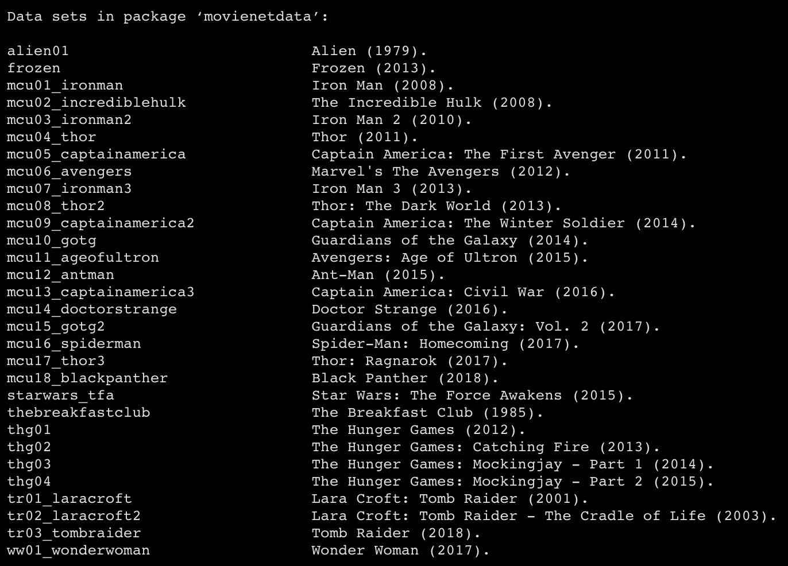

+++
draft = false
date = 2020-03-03T15:28:00Z
title = "movienetData: A data package for character interactions in popular films."
description = "Introduction to movienetData, an R package containing movie character interaction network data"
slug = "" 
tags = ["R", "networks", "movies"]
categories = []
externalLink = ""
series = []

+++


I recently released the data I collected during my PhD research as a [data package](https://github.com/pj398/movienetData) for R. The main reasons I did this are:

**Sharing**

One of the most common questions I get when chatting to people at conferences etc. is whether my data is publicly available. I assume this means that people would be interested in taking a look at the data, analysing it, playing around with it and such.

The dataset was generated [to answer questions](https://doi.org/10.1080/14680777.2018.1510846) about the narrative marginalisation of women in popular cinema. However, there are a number of reasons why somebody might want to use it beyond this purpose: 

* It is an ideal dataset for exploring _character networks_ in all their complexity - each film in the dataset comes with both an event list, which can be used for constructing dynamic network representations of the narratives, and an adjacency matrix derived from this event list, which can be used for static network representations. The event list also indexes each interaction by scene, allowing for the interaction data to be grouped into story chunks. 
* The dataset offers useful teaching data for illustrating basic network analysis ideas using familiar, easy to grasp examples of networks.
* I'm sure there are all kinds of interesting questions about the films that the data can help to answer that I didn't think to ask.

**Making my life easier**

I plan on sharing other aspects of my character network analysis work, and releasing the data this way allows me to separate out the data from the core functionality of the various tools and functions that I work with. This is useful as it helps me to ensure that they make sense independently of the particular data with which I have been using them to work. 

Finally, I wanted some hands-on experience with R package development, and data packages offer a great way to learn the basics of package structure and documentation.

## How to use the data

__In R__

If you use R, you can install the package using `devtools`:

```R
# install.packages("devtools")
devtools::install_github("pj398/movienetData")
```

Then, load the package:

```R
library(movienetData)
```

You can browse the complete list of different films in the dataset using `data(package = "movienetData")`:



And load a specific film into the workspace using e.g. `data("marvel_01", "movienetData")`.

Each film is stored as a list containing three elements:

1.  The event list. Each row contains information on a line of dialogue,
    with columns corresponding to `eventID`, `sceneID`, `speakerID`, and
    dummy variables for each recipient.
2.  The node list. Rows correspond to named speaking characters, with
    columns corresponding to variables for ID, name, total lines spoken
    (`nlines`), total times spoken to (`linesin`), and gender.
3.  The adjacency matrix. This is derived from the event list through
    aggregation and can be useful for static purposes such as
    visualising the network as a sociogram.

Access specific elements by name or by indexing the list:

``` R
# Get the nodes by name
marvel_01$node_list
```

``` R
# Get the nodes by indexing
marvel_01[[2]]
```

*Example:*

If you just want to create a quick network diagram for the film *Black Panther*, you can do something like this:

```R
black_panther <- movienetData::marvel_18
# install.packages("network")
library(network)
# Create network object from adjacency matrix
bp_net <- network(black_panther$adjacency)
# Plot the network
plot(bp_net, label = black_panther[[2]]$char_name, 
     edge.col = "lightpink1", 
     vertex.cex = sqrt(black_panther[[2]]$nlines)/3, 
     label.pos = 3, arrowhead.cex = 0.7,
     vertex.col = ifelse(black_panther[[2]]$char_female == 1, 
                         "#ded649", "#55467a"), 
     main = "Character interactions in Black Panther (2018)")

```


**Not in R**

If you're not an R user, you can still access the raw data from the [package source on Github](https://github.com/pj398/movienetData). In the `data-raw` folder you will find the CSV files for each film's event list and node list.