+++ 
draft = false
date = 2020-03-09T23:24:18Z
title = "Making glitch art in R"
description = "An introduction to making glitch art in R using databending of image files"
slug = "" 
tags = ["R", "art", "creative"]
categories = []
externalLink = ""
series = []
+++

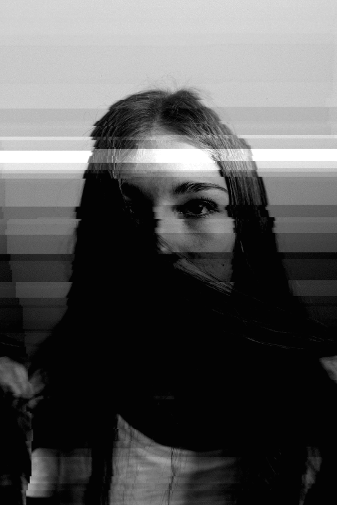

In this post I'm going to talk about [glitch art](http://jameshconnolly.com/glitchtalk.html) and how to make it entirely in R using databending.

## What is glitch art?

This is actually a difficult question to answer, as glitch art can mean many different things to different people (I'll provide some [further reading](#further_reading) links at the end of this post for those who want to dig deeper). In the sense I'm using it, glitch art "is visual art that involves or is caused by digital glitches or errors", to use [stAllio's terms](http://blog.animalswithinanimals.com/2008/08/databending-and-glitch-art-primer-part.html). 

The errors that produce the glitch art can be a genuine malfunction on the part of the machine, such as when a digital camera incorrectly writes a photo file and artefacts are found in the resulting image. [Databending](https://en.wikipedia.org/wiki/Databending), on the other hand, is the deliberate misuse of digital information for artistic or aesthetic purposes, and it's this method of producing glitch art that I'm talking about in this post. Databending does not only apply to images and can involve the manipulation of any type of file, but in this post I'm going to stick to databending image files^[More specifically, I'm going to stick to JPEGs. File type does matter with databending, as [this guide](http://creative.colorado.edu/~keho2869/glitch/Vernacular-of-File-Formats.pdf) illustrates beautifully. I stuck to JPEG here because this post is long enough as it is, and I particularly like the telltale horizontal effects of databending JPEGs. Experimenting with other formats is on my to-do list of next steps in this project.].

One of the simplest methods of databending an image is to trick a software programme that is not designed for image files into opening an image file. Like all digital files, images are made up of underlying bytes of information, and this raw data can be expressed and represented in different ways. Opening an image file in a text editor, for example, allows us to see and edit a text-based representation of the file's binary data. For illustration, here is a screensnip of a photo opened in [Notepad++](https://notepad-plus-plus.org/):

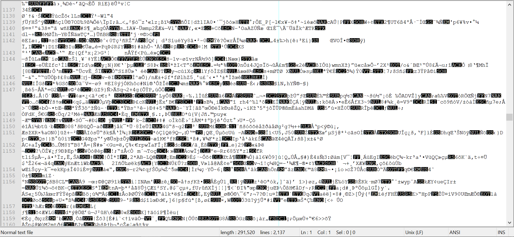

Making even small changes to this data (adding, deleting, moving, duplicating sections) can produce some really interesting results. One of the ways I used to entertain myself during class when I was a masters student was to databend images using the software installed on the university PCs. That's why, if you've ever seen my work desktop, you'll notice that my desktop background is the following image:

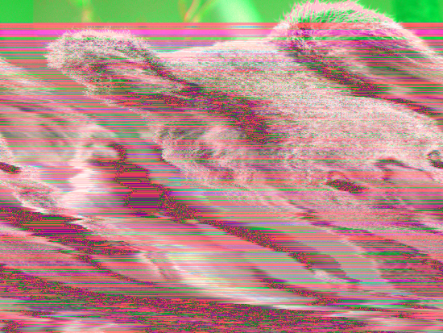

This is actually a glitched version of the following photo, which is one of the photos bundled with Windows 7 in the "Sample Pictures" folder:

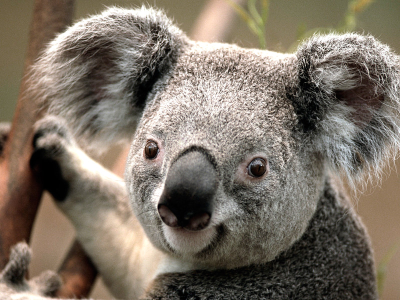

## Databending in R

So far, so good - as you can see, the process of generating glitch art can be as easy as opening an image in a text editor, making a couple of changes and hitting save (note that if you're going to try this, do it on a copy of the image as the data corruption is typically irreverisble). In fact, making glitch art is now even easier than this, as there are a bunch of tools available (including mobile apps) that allow you to glitch images in all kinds of deliberate and controlled ways. 

Personally, I find these more controlled and interactive approaches to glitching less rewarding than the "suck it and see" approach of applying chance operations to the data and seeing a unique result, like when you're making random edits in a text editor. However, the text editor approach still involves popping in and out of different image and text manipulation softwares and browsers, so I decided to set myself the challenge of streamlining this process so that it can be done entirely within R. 

As far as I can tell from searching on Google and CRAN, nobody has done this in R before, so I decided to just make it up as I go along. 

## Defining a glitch method

#### Step 1: find a guinea pig

Or, more specifically, a bear. I needed an image to experiment on, so I went to Unsplash and found [this magnificient bear](https://unsplash.com/photos/y421kXlUOQk) to participate in my trials:

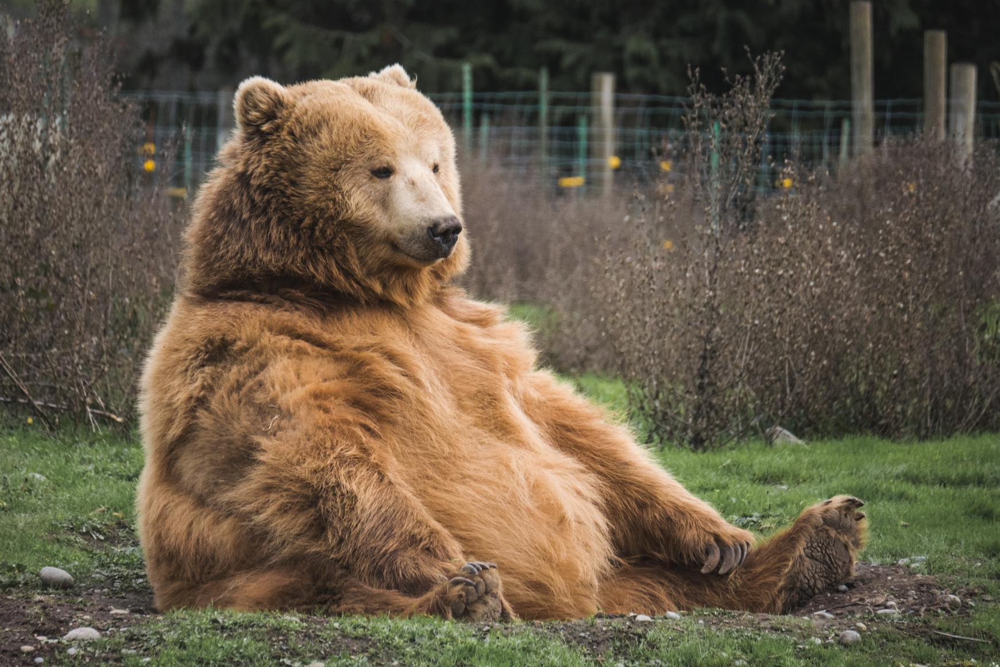

#### Step 2: represent the file as raw data

The next step was to find a way of bringing this bear into R as raw data that I can mess with. The [readr](https://readr.tidyverse.org/) package provides a handy function `readr::read_file_raw()` to do this, but first I wanted to reduce the file size. As I was aiming to do this whole thing in R, I needed a way of handling images in R. There are plenty of tools for doing this, but I decided to take this opportunity to try out [magick](https://cran.r-project.org/web/packages/magick/index.html).

Using magick, I reduced the file size to 40% of the original:


```R
library(magick)
```

```r
library(magrittr)
```

```r
magick::image_read("data/raw/bear.jpg") %>%
  magick::image_scale(geometry = 
                        geometry_size_percent(width = 40, height = 40)) %>%
  magick::image_write("data/bear_sml.jpg", format = "jpg")
```

and then read in this smaller image file:


```r
library(readr)
raw_image <- readr::read_file_raw("data/bear_sml.jpg")
```

This produces an object of class `raw` and length 291520.

The data looks like so:


```r
raw_image[1:100]
```

```
##   [1] ff d8 ff e0 00 10 4a 46 49 46 00 01 01 01 00 48 00 48 00 00 ff e2 02 1c 49
##  [26] 43 43 5f 50 52 4f 46 49 4c 45 00 01 01 00 00 02 0c 6c 63 6d 73 02 10 00 00
##  [51] 6d 6e 74 72 52 47 42 20 58 59 5a 20 07 dc 00 01 00 19 00 03 00 29 00 39 61
##  [76] 63 73 70 41 50 50 4c 00 00 00 00 00 00 00 00 00 00 00 00 00 00 00 00 00 00
```

This we can wreck!

#### Step 3: write a glitch function

There are obviously lots of ways in which we could mess with this data, but I wanted to harness the power of [chance operations](https://en.wikipedia.org/wiki/An_Anthology_of_Chance_Operations). Here's how I decided to go about it:

1. Randomly select _N_ change points in the raw vector.
2. For each of these change points, randomly make a change _M_.

Where _M_ can be one of the following operations, with equal probability:

* `add`: take all unique values of the raw vector, randomly sample a number of them, and then insert these in at the change point.
* `move`: take a chunk of elements starting at the change point, delete them, and then reinsert them at a random point in the raw vector.
* `clone`: as with `move`, but don't delete the chunk, simply copy it to another location.
* `delete`: take a chunk of elements starting at the change point and delete them.

One thing to note about databending images is that it is important not to make changes to the data near the start of the file, as this is the file header and corrupting it can destroy the image altogether. So I limit the possible change points that can be chosen to anything after the first 0.5% of the elements and before the final 5% of the elements (to avoid subscript-out-of-bounds type errors).

This all looks like so:

```r
glitch_it <- function(input_data, n_changes = 10, noise = 20) {
  # Generate a safe copy of the raw file
  glitched <- input_data
  # Sample to find the change points (indices for the raw vector)
  change_points <- runif(n = n_changes, 
                         min = as.integer((length(input_data) / 100) * 0.5), 
                         max = length(input_data) - 
                           ((length(input_data) / 100) * 5))
  # Now iterate over these change points
  for (i in change_points) {
    # Then, decide what to do at each change point
    how_to_mess <- sample(c("add", "move", "clone", "delete"), 1)
    
    # And mess with it in that way
    if(how_to_mess == "add") {
      glitched <- append(glitched, sample(unique(input_data), 
                                          sample(1:noise, 1), TRUE), i)
    } 
    if(how_to_mess == "move") {
      move_seed <- sample(1:noise, 1)
      move_data <- glitched[i:(i + move_seed)]
      glitched <- glitched[-(i:(i + move_seed))]
      safe_range <- (length(glitched) / 100) * 
        10:(length(glitched) - (length(glitched) / 100) * 5)
      glitched <- append(glitched, move_data, 
                         after = sample(safe_range, 1))
    }  
    if(how_to_mess == "clone") {
      move_seed <- sample(1:noise, 1)
      move_data <- glitched[i:(i + move_seed)]
      safe_range <- (length(glitched) / 100) * 
        2:(length(glitched) - (length(glitched) / 100) * 5)
      glitched <- append(glitched, move_data, 
                         after = sample(safe_range, 1))
    }
    if(how_to_mess == "delete") {
      move_seed <- sample(1:noise, 1)
      move_data <- glitched[i:(i + move_seed)]
      glitched <- glitched[-(i:(i + move_seed))]
    }
  }
  # Output the glitched data
  glitched
}
```

The number of change points to identify can be passed in as an argument, and the `noise` argument sets the ceiling of how big the chunks that are selected when making changes can be.

#### Step 4: glitch it

Now we're ready to glitch our guinea pig. Let's make 10 changes, and set the noise to 20:

```r
my_glitch <- glitch_it(raw_image, n_changes = 10, noise = 20)
```

#### Step 5: look at the results

Now we want to take a look at what we've just created without leaving R.

We can use magick to do this, as magick can read raw data, and will print this image to the RStudio Viewer pane:


```r
plot_glitch <- function(glitch) {
  magick::image_read(glitch) %>% 
    magick::image_scale(geometry_size_pixels(width = 550)) %>% 
    print()
}
```


```r
plot_glitch(my_glitch)
```

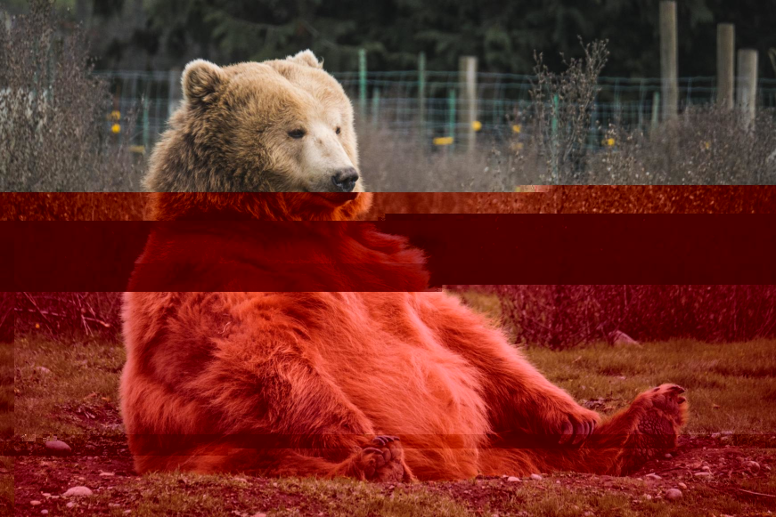

Great! How about if we tweak the parameters a little:


```r
my_glitch <- glitch_it(raw_image, n_change = 50, noise = 50)
plot_glitch(my_glitch)
```

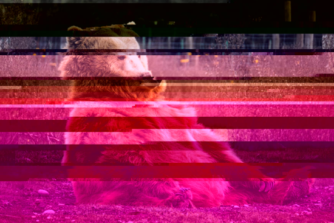

Again, this looks pretty good.

#### Step 6: celebrate (or not...)

Actually, running the glitch_it() function a few times reveals a problem with this method: the resulting images often corrupt in a way which destroys whole sections of the image with grey blocks:

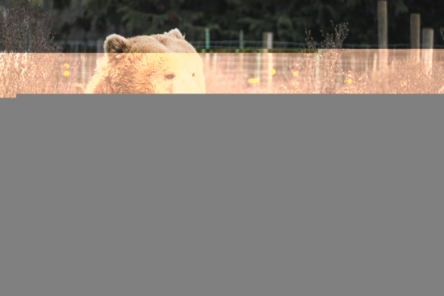

#### Step 7: try a hacky fix

Presumably, this corruption is something to do with the glitched vector being a different length to the original vector - something critical ends up not being where it's supposed to be. Since I already protected the header area from corruption, I tried to solve the problem by adding some code to the function just before outputting the vector which makes sure that the glitched vector is the same length as the original vector (by either randomly cutting or inserting data into the middle to correct the length).


```r
# Make sure the glitched data ends up the same length as the input data
  size_diff <- length(glitched) - length(input_data)
  corr_min <- as.integer((length(raw_image) / 100) * 0.5)
  corr_max <- length(glitched) - ((length(input_data) / 100) * 5)
  if(size_diff > 0) { # Delete stuff if output longer than input
    glitched <- glitched[-sample(corr_min:corr_max, size = size_diff)]
  }
  if (size_diff < 0) { # Add stuff if output shorter than input
    glitched <- append(glitched, 
                       sample(unique(input_data), abs(size_diff), TRUE), 
                       after = length(glitched)/2)
  }
```

This successfully made sure that the vector lengths matched, but it solved nothing and I still got occasional grey blocks in my glitches.

#### Step 8: try a completely different approach

Unsatisfied, I decided to take a different approach altogether and define a new glitch method. Instead of harnessing the power of chance operations, I decided to harness the meh of find and replace. This is far less exciting than the randomness-within-randomness chaos of the previous method, but seemed like it was worth a shot.

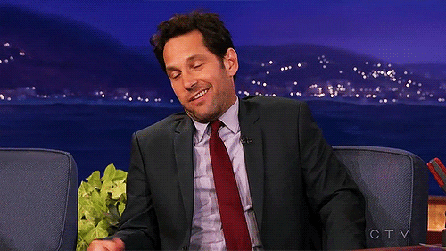

The idea behind this method is simple:

1. Gather all the unique values in the raw vector and pick one (_F_) at random. 
2. Determine the vector indices for each occurrence of _F_.
3. Choose a replacement value _R_ by repeating (1).
4. Replace all occurrences of _F_ with _R_.

Again, we'll only make these changes after the first 0.5% of the vector in order to protect the header from corruption.


```r
glitch_far <- function(input_data, n_changes = 5) {
  glitched <- input_data
  for (i in 1:n_changes) {
    change_rows <- grep(pattern = sample(unique(input_data), 1), x = input_data)
    change_to <- sample(unique(input_data), 1)
    for (safe in change_rows) {
      if(safe > (length(input_data) / 100) * 0.5) {
        glitched[safe] <- change_to
      }
    }
  }
  glitched
}
```

And give it a whirl:


```r
my_glitch <- glitch_far(raw_image, n_change = 5)
plot_glitch(my_glitch)
```

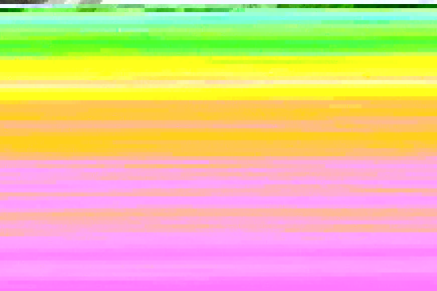

Well, there's no grey blocks, and this is a pretty interesting result, but our bear friend seems to have got a little lost in the sauce here.

Even when making fewer changes, we still get images like this:


```r
my_glitch <- glitch_far(raw_image, n_change = 1)
plot_glitch(my_glitch)
```

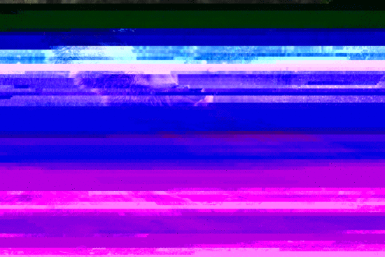

These generate some pretty cool colour palettes, but that's not really what I'm going for here.

#### Step 9: actually solve the problem

`glitch_far()` isn't breaking the file in the way that `glitch_it()` did, but it's clearly making too many changes and our original image is getting lost. So we need to reign in the find-and-replace approach a little bit.

Modifying the approach in Step 8, I defined a more flexible version like so:

1. Gather all the unique values in the raw vector and pick one _F_ at random. 
2. Determine the vector indices for each occurrence of _F_.
3. Choose a replacement _R_ value by repeating (1).
4. Replace **some of the** occurrences of _F_ with _R_.

We can determine how many of the sampled values to actually replace with a tuning parameter, allowing us to specify a percentage of the occurences to replace:


```r
glitch_far2 <- function(input_data, n_changes = 5, tune = 100) {
  glitched <- input_data
  for (i in 1:n_changes) {
    change_rows <- grep(pattern = sample(unique(input_data), 1), x = input_data)
    change_samp <- sample(change_rows, 
                          (length(change_rows) / 100) * min(tune, 100))
    change_to <- sample(unique(input_data), 1)
    for (safe in change_samp) {
      if(safe > (length(input_data) / 100) * 0.5) {
        glitched[safe] <- change_to
      }
    }
  }
  glitched
}
```

This produces nice clean results which don't break the image and allow the original image to come through:


```r
my_glitch <- glitch_far2(raw_image, n_changes = 1, tune = 8)
plot_glitch(my_glitch)
```

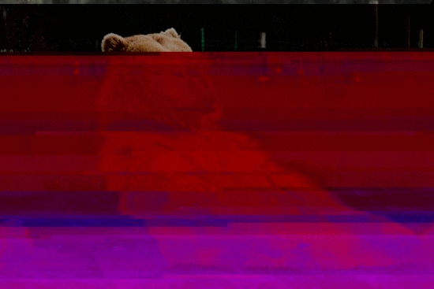

### A note on the GIFs 

The goal of this project was to do everything without leaving R. This also applies to the GIFs I'm embedding in this post - they were created by iteratively performing 10 glitches and writing to file:


```r
for (i in 1:10) {
  my_glitch <- glitch_far2(raw_image, n_changes = 1, tune = 8)
  my_path <- paste0("temp/glitch_", i, ".png")
  my_glitch %>%
    image_read() %>%
    image_scale(geometry_size_pixels(width = 550)) %>%
    image_write(path = my_path, format = "png")
}
```

and then using ImageMagick to create a GIF from these images in the command line by running `magick convert -delay 50 temp/*.png img/gif/my_gif.gif` in the terminal.

## Putting the glitcher into action

Now that we have a working glitch function, I want to test it out with some images that are more suited to databending. The ideal images for databending are those with not too many colours, and those which feature a subject against a plain background. I went back to [Unsplash](https://unsplash.com), browsed, and picked the first three that caught my eye:

<div class="icon-container">
  <a href="https://unsplash.com/photos/yQILyG_fGuE" target="_blank">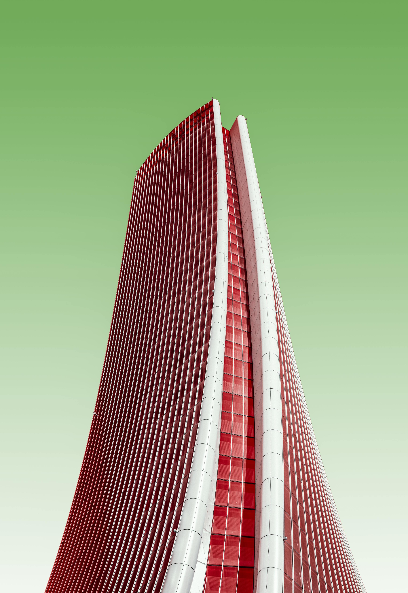</a>
  <a href="https://unsplash.com/photos/LWuHsMPzoss" target="_blank">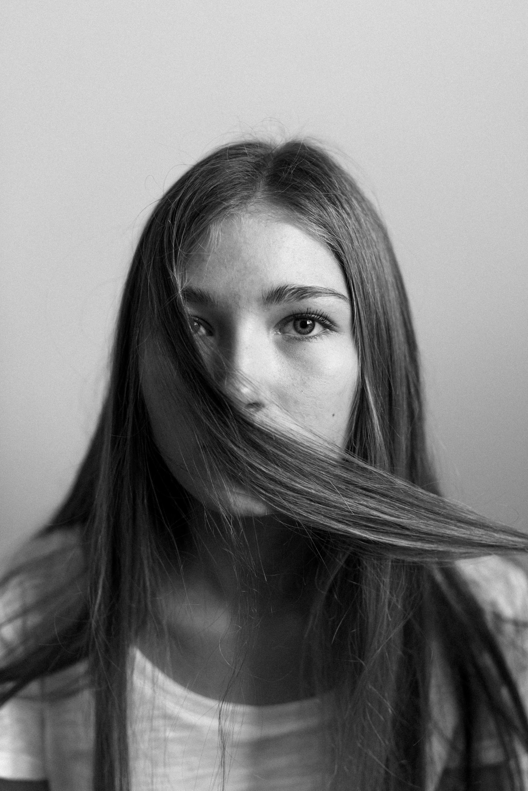</a>
  <a href="https://unsplash.com/photos/i0yjni9irCA" target="_blank"></a>
</div>

Here are some of my favourite results and how I got them:

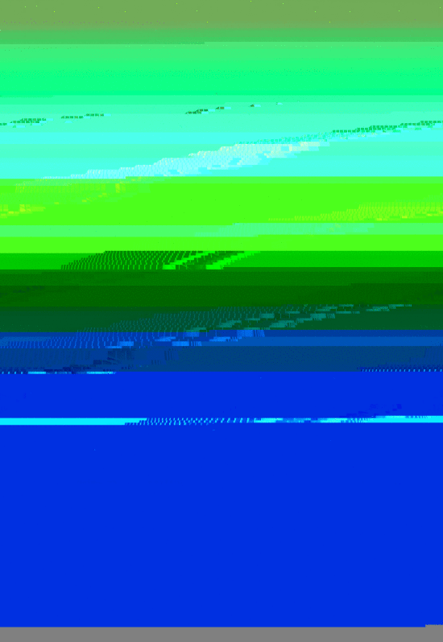
<center>`glitch_far2(raw_image, n_changes = 1, tune = 5)`</center>


<center>`glitch_far2(raw_image, n_changes = 1, tune = 8)`</center>

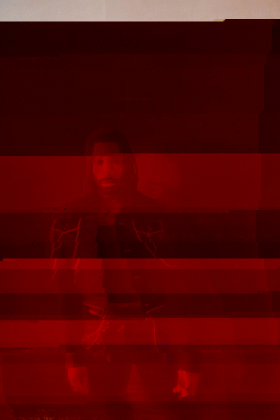
<center>`glitch_far2(raw_image, n_changes = 1, tune = 6)`</center>

Go forth and databend!

## Further reading {#further_reading}

For an overview of glitch art, I recommend reading James H. Connelly's fantastic [talk on the subject](http://jameshconnolly.com/glitchtalk.html).

For a more how-to and data-bending oriented walkthrough, [stAllio's primers](http://blog.animalswithinanimals.com/search/label/primers) are brilliant.

Additional resources on glitch art and databending from:

* [Glitchet](https://www.glitchet.com/resources)
* [Daniel Temkin](http://danieltemkin.com/Tutorials/)
* [Doc Pop](https://docpop.org/2014/01/a-glitch-primer-editing-image-files-with-text-editors/)
* [Tobias Løfgren](https://tobloef.com/fun/glitch-art)
* [Datamoshing](http://datamoshing.com/2016/06/15/how-to-glitch-jpg-images-with-data-corruption/)
* [Paul Weiner](https://critiquecollective.com/2014/03/13/tutorial-on-databending-and-glitch-art/)
* [Rosa Menkman](http://creative.colorado.edu/~keho2869/glitch/Vernacular-of-File-Formats.pdf)
* [Unknown](https://static1.squarespace.com/static/525bec67e4b0ef380880a5bc/t/597ac1e9e6f2e1264339d89f/1501217258536/Glitching.pdf)

Finally, this was a really fun way for me to use R for something creative, and in the process I got some hands on experience using the magick package and ImageMagick to handle images within R in all kinds of ways. I was mostly interested in reading, writing, scaling and viewing the images, but there are many more cool and interesting things that magick can do, and the [package vignette](https://cran.r-project.org/web/packages/magick/vignettes/intro.html) illustrates these very nicely. 
