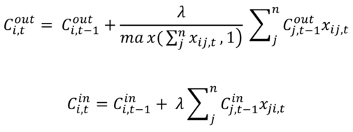
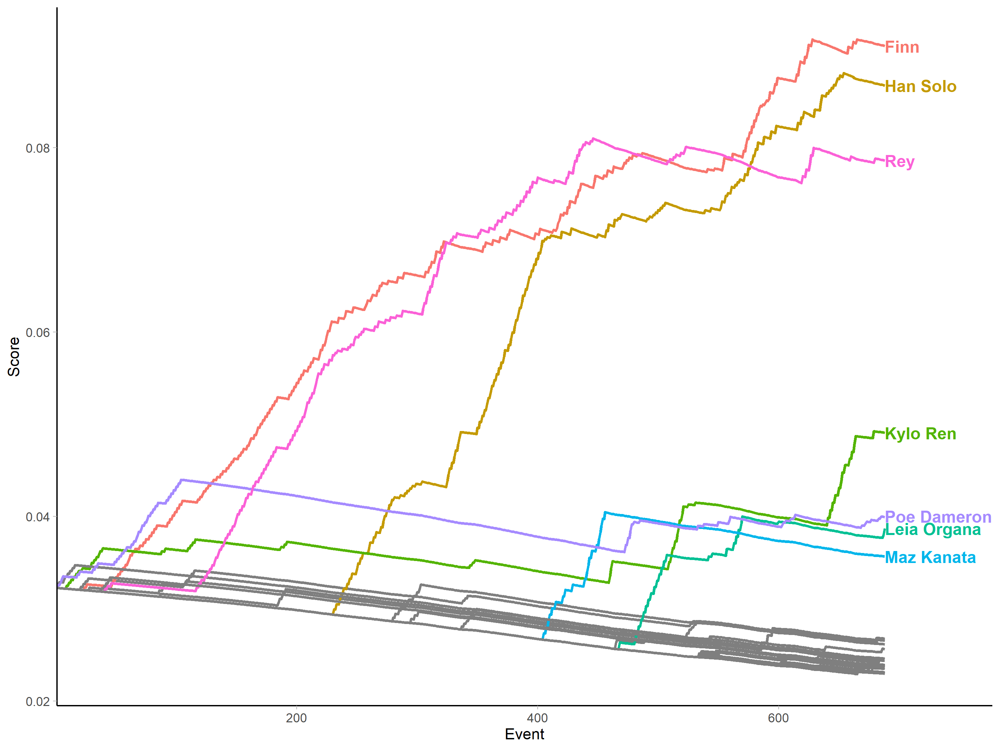
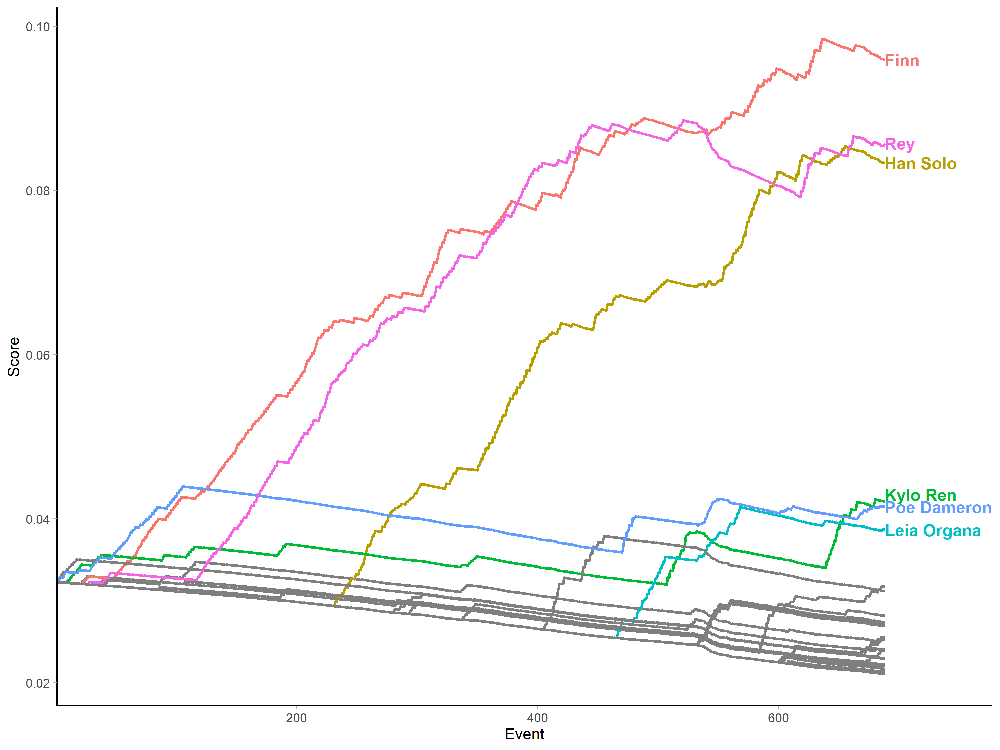
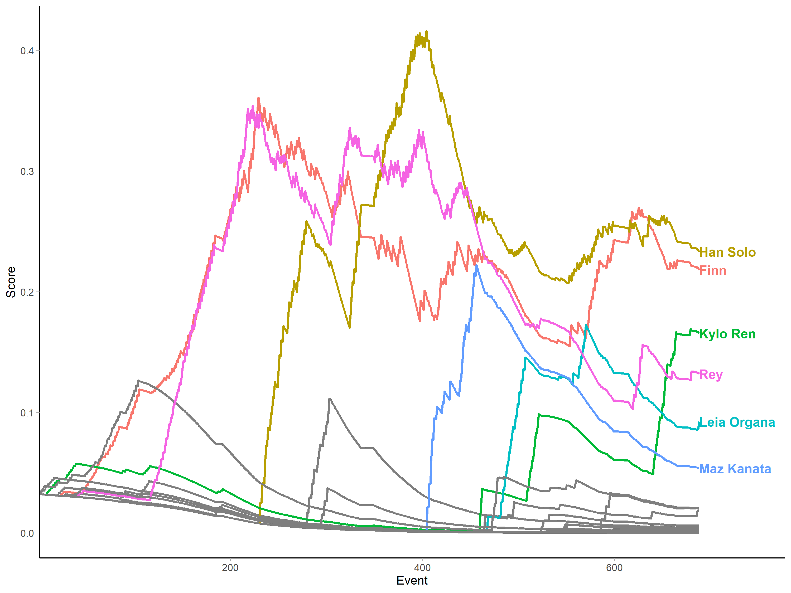
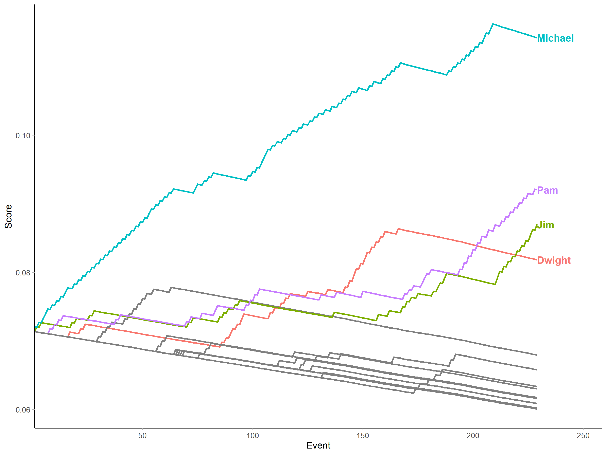
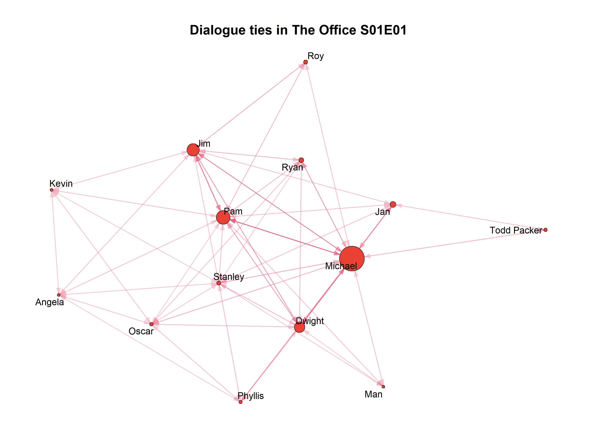

+++ 
draft = false
date = 2020-04-30T12:05:15+01:00
title = "Implementing narrative centrality for character interaction networks: a practical walkthrough"
description = "This post provides a practical illustration of how to implement a recently published dynamic measure of character centrality in film narratives."
slug = "" 
tags = ["R", "networks", "movies"]
categories = []
externalLink = ""
series = []
+++


In this post I'll provide a practical walkthrough to complement a paper I wrote with my co-authors Johan Koskinen and Eithne Quinn on measuring centrality in character interaction networks, which has now been published in *Social Networks* (read the published version [here](https://doi.org/10.1016/j.socnet.2020.03.003) or the accepted author manuscript [here](https://petejon.es/posts/2020-04-30-narrative-centrality/Jones-Quinn-Koskinen-2020-accepted-manuscript.pdf).).

I've been presenting this work at conferences for a while now, and have received some great feedback along the way. Now that the paper is finalised and published, it seemed like a good opportunity to share the code I use to implement the measure in R and show how to use it.

## The paper in a nutshell

I won't try to recreate the paper within this post, as I'd rather stick to the practical side here and let readers learn more about the measure from the paper where it is properly explained and contextualised.

However, a very brief nutshell summary might help inform what follows. Broadly speaking, the paper reflects on the relationship between network centrality and narrative centrality. In particular, it argues that in order for a network analytic measure to tell us about a narrative text, it needs to be able to reflect the sequence of events that take place in the narrative. In other words, we need to represent the narrative as a dynamic network, and our measures ought to be designed to work on such a dynamic representation. 

To this end, we propose a simple dynamic measure which allows characters' scores to increase when they either send or receive a relational event (in our case, when they either speak or are spoken to) in a way that reflects the characters with whom they interact as well as the sequence of such interactions.

This measure, which has an "out" version and an "in" version to reflect the directionality of interaction data, looks like so:



We argue that this approach reveals much more about the dynamics of a narrative text because it allows us to say something meaningful about the interlocking trajectories which characters take through narratives - trajectories which are often extremely difficult to summarise using a single static value.

## What does applying the measure look like in practice?

The easiest way to explain how to use the measure is to work through a practical example. So, following the paper, I'll use the measure to calculate the narrative centrality of characters in _Star Wars: The Force Awakens_ (2015) using character interaction data I collected in my PhD research. _The Force Awakens_ is one of 30 films available in the [{movienetData}](https://github.com/pj398/movienetData) package, so it will make for an easy demonstration.

#### Defining the function

First, we need to define a function for calculating the centralities. The goal is to calculate a score for each character at each time point, so essentially we want an *N*-by-*T* matrix, where _N_ is the total number of named speaking characters and _T_ is the total number of narrative events (in my case, dialogue interactions). In fact, we want two such matrices - one for the speaking scores and one for the spoken-to scores. 

I define the function in a way that allows the user to specify which matrix they want via the `mode` argument, which can take the values "in" (for the spoken-to scores), "out" (for the speaking scores) or "both". In the case of "both", which is the default option, a named list is returned containing first the "out" matrix and then the "in" matrix. For either "out" or "in", a single matrix is returned. 

The weighting parameter lambda can be specified via the argument `wp`, which has a "sensible default" of 0.01 (see the Appendix of the paper for a detailed discussion of this).

The argument `normalised` allows the user to specify whether to return the normalised scores (`normalised = TRUE`) or the absolute scores (`normalised = FALSE`). Normalising the scores here refers to dividing each character's score at time _t_ by the sum of all character scores at time _t_. The default value is `TRUE`.

Finally, I want the function to be flexible with regard to the structure of the event list on which it is applied. To provide a balance between this flexibility and creating some predictability regarding the input data structure, the function assumes an event list (given via the `event_list` argument) containing a column of speaker IDs in the first column and dummy variables for each potential receiver in column `recipient ID + 1`. So Character 3 will be represented by column 4, such that a value of 1 in cell `[3, 4]` means that Character 3 was the recipient of the line of dialogue spoken at time `t=3`. In some cases, the input data will contain other columns. For example, the {movienetData} event lists also contain columns `eventID` and `sceneID`. The argument `start_at` allows the user to skip any such columns so long as they are positioned prior to the speaker ID. Basically, the value given for this argument should be the speaker ID column. So if the speaker ID column is first in the input event list, `start_at` should be set at 1 (which is the default), but if the speaker ID column is column 3 in the input event list (as, for example, in the {movienetData} data), `start_at` should be set at 3. This will become clearer in the practical examples below.

This might seem at first like an unusual assumed structure, but I prefer this dummy-based event list format to a (perhaps more conventional) senderID-recipientID edgelist-style format because the data is characterised by sender exclusivity and receiver non-exclusivity. That is, there is only ever one sender per event, but they might be addressing multiple recipients simultaneously (as is the case, for example, with e-mail or tweet data). The event list allows this multi-recipient structure to be reflected clearly in the data - one row per event - and streamlines both the data collection process and the actual computation when using the measure. Any additional variables for each event (for example, _weight_ or _type_ may be relevant in other contexts) can easily be included before the speaker ID column, and `start_at` ensures that differences in the number or name of such variables won't make analysis any more complicated.

An optional character vector containing the names of the characters corresponding to the node IDs can be passed in via the `chars` argument, and these names will be used to supply column names in the returned matrices. If these are not provided, character names will be inferred from the input event list.

All together, this looks like so (I've also made this available as a [gist](https://gist.github.com/pj398/7b149797e2cdc665ad52a7232fd3dfb8)):


```r
narrative_centrality <- function(event_list, 
                                 chars = NULL,
                                 mode = "both",
                                 wp = 0.01,
                                 normalised = TRUE,
                                 start_at = 1) {
  C_in <- matrix(1, nrow(event_list), length(chars))
  C_out <- matrix(1, nrow(event_list), length(chars))
  C_in_norm <- matrix(1, nrow(event_list), length(chars))
  C_out_norm <- matrix(1, nrow(event_list), length(chars))
  if(is.null(chars)) {
    chars <- colnames(event_list)[start_at + 1:ncol(event_list)]
  }
  colnames(C_in) <- chars
  colnames(C_in_norm) <- chars
  colnames(C_out) <- chars
  colnames(C_out_norm) <- chars
  # Compute the scores
  C_in_t <- matrix(1, length(chars), 1)
  C_out_t <- matrix(1, length(chars), 1)
  for (t in 1:nrow(event_list)) {
    speaker <- event_list[t, start_at]
    receivers <- which(event_list[t, (start_at + 1):dim(event_list)[2]] == 1)
    C_in_t[receivers] <- C_in_t[receivers] + (wp * C_in_t[speaker])
    C_out_t[speaker] <- C_out_t[speaker] + 
      ((wp / length(receivers)) * sum(C_out_t[receivers]))
    for (c in 1:length(chars)) {
      C_in[t, c] <- C_in_t[c]
      C_out[t, c] <- C_out_t[c]
      C_in_norm[t, c] <- C_in_t[c] / sum(C_in_t)
      C_out_norm[t, c] <- C_out_t[c] / sum(C_out_t)
    }
  }
   # Return the requested values according to `normalised` and `mode`
  if(normalised == TRUE) {
    if(mode == "both") {
      return(list("out_scores" = C_out_norm, "in_scores" = C_in_norm))
    }
    if(mode == "in") {
      return(C_in_norm)
    }
    if(mode == "out") {
      return(C_out_norm)
    }
  } else {
    if(mode == "both") {
      return(list(C_out, C_in))
    }
    if(mode == "in") {
      return(C_in)
    }
    if(mode == "out") {
      return(C_out)
    }
  }
  
}
```

So to get the centralities for _The Force Awakens_, we need to read in the film data:


```r
# install.packages("devtools")
# devtools::install_github("pj398/movienetData")
tfa <- movienetData::starwars_01
```

and, just to be clear, this event list is structured like so:


```r
tfa$event_list[1:5, 1:7]
```

<p></p>

```
##      eventID sceneID speakerID Lor.San.Tekka..1. Poe.Dameron..2. Kylo.Ren..3. Captain.Phasma..4.
## [1,]       1       1         1                 0               1            0                  0
## [2,]       2       1         2                 1               0            0                  0
## [3,]       3       1         1                 0               1            0                  0
## [4,]       4       1         2                 1               0            0                  0
## [5,]       5       1         2                 1               0            0                  0
```

our speaker ID column is column 3, and our dummy variables for each recipient start at column 4 and occupy the remaining columns in the dataset (here I only show the first few for readability).

So now we can run the function, remembering to start at column 3:


```r
tfa_scores <- narrative_centrality(tfa$event_list, 
                                   chars = tfa[[2]]$char_name, 
                                   wp = 0.01, 
                                   start_at = 3)
```

On its own, the returned matrix is a little too unwieldy to offer immediate insights into what's going on. So we can plot the scores to see the character trajectories more clearly.

First, I'll put the data into a [tidy](https://r4ds.had.co.nz/tidy-data.html) format to make things easier. In the process, I'll add a variable which makes sure that only those characters whose share of scores at the end of the film is greater than their share at the start of the film are labelled, which will make the graph a little more readable.


```r
library(tidyverse)
```

<p></p>

```r
tfa_out_tidy <- cbind.data.frame("Event" = seq.int(1, dim(tfa_scores$out_scores)[1]), 
                 tfa_scores$out_scores) %>% 
  tidyr::pivot_longer(cols = -Event,
                      names_to = "Character", 
                      values_to = "Score") %>%
  mutate(Label = ifelse(Character %in% names(which(tfa_scores$out_scores[1, ] < tfa_scores$out_scores[dim(tfa_scores$out_scores)[1], ])), 
                        Character, 
                        NA))

tfa_in_tidy <- cbind.data.frame("Event" = seq.int(1, dim(tfa_scores$in_scores)[1]), 
                                 tfa_scores$in_scores) %>% 
  tidyr::pivot_longer(cols = -Event,
                      names_to = "Character", 
                      values_to = "Score") %>%
  mutate(Label = ifelse(Character %in% names(which(tfa_scores$in_scores[1, ] < tfa_scores$in_scores[dim(tfa_scores$in_scores)[1], ])), 
                        Character, 
                        NA))
```

So the data now looks like so:

```r
tfa_out_tidy
```

<p></p>

```
## # A tibble: 21,328 x 4
##    Event Character          Score Label      
##    <int> <chr>              <dbl> <chr>      
##  1     1 Lor San Tekka     0.0326 <NA>       
##  2     1 Poe Dameron       0.0322 Poe Dameron
##  3     1 Kylo Ren          0.0322 Kylo Ren   
##  4     1 Captain Phasma    0.0322 <NA>       
##  5     1 Finn              0.0322 Finn       
##  6     1 Unkar             0.0322 <NA>       
##  7     1 Rey               0.0322 Rey        
##  8     1 General Hux       0.0322 <NA>       
##  9     1 Lieutenant Mitaka 0.0322 <NA>       
## 10     1 Han Solo          0.0322 Han Solo   
## # ... with 21,318 more rows
```

And then this can be plotted. First, the speaking scores:


```r
library(directlabels)
```

<p></p>

```r
tfa_out_tidy %>%
  ggplot(aes(x = Event, y = Score, group = Character, colour = Label)) + 
  geom_line(size = 1, show.legend = FALSE) +
  scale_x_continuous(expand = expand_scale(c(0, 0.13))) + 
  geom_dl(aes(label = Label), 
          method = list("last.bumpup", fontface = "bold")) + 
  theme_light() + 
  theme(axis.line = element_line(colour = "black"), 
        panel.grid.major = element_blank(), 
        panel.grid.minor = element_blank(),
        panel.border = element_blank(),
        panel.background = element_blank())
```



and then the spoken-to scores:


```r
tfa_in_tidy %>%
  ggplot(aes(x = Event, y = Score, group = Character, colour = Label)) + 
  geom_line(size = 1, show.legend = FALSE) +
  scale_x_continuous(expand = expand_scale(c(0, 0.13))) + 
  geom_dl(aes(label = Label), 
          method = list("last.bumpup", fontface = "bold")) + 
  theme_light() + 
  theme(axis.line = element_line(colour = "black"), 
        panel.grid.major = element_blank(), 
        panel.grid.minor = element_blank(),
        panel.border = element_blank(),
        panel.background = element_blank())
```



Here we can see the same graphs used in the paper. They illustrate many of the strengths of the measure. For example, we can see that some characters' importance is very much temporally situated - as with Poe Dameron, who is pivotal in initiating the action, but disappears after the first act to return later in the film after other characters have established themselves as the primary narrative actors. This illustrates a second desirable property of the measure: when a character stops participating (in this case vocally), their share of the "character space" declines, as we see with characters like Poe and Maz Kanata, who come and go, but also with Rey when she is kidnapped and becomes temporarily much more passive in the second act of the film.

To illustrate the effect of different values of the weighting parameter lambda (again, see the paper for full discussion of this), let's recalculate and re-plot the scores with a higher lambda value of 0.05.


```r
tfa_scores_2 <- narrative_centrality(tfa$event_list, 
                                   chars = tfa[[2]]$char_name, 
                                   mode = "out",
                                   wp = 0.05, 
                                   start_at = 3)

cbind.data.frame("Event" = seq.int(1, dim(tfa_scores_2)[1]), tfa_scores_2) %>% 
  tidyr::pivot_longer(cols = -Event,
                      names_to = "Character", 
                      values_to = "Score") %>%
  mutate(Label = ifelse(Character %in% names(which(tfa_scores_2[1, ] < tfa_scores_2[dim(tfa_scores_2)[1], ])), 
                        Character, 
                        NA)) %>%
  ggplot(aes(x = Event, y = Score, group = Character, colour = Label)) + 
  geom_line(size = 1, show.legend = FALSE) +
  scale_x_continuous(expand = expand_scale(c(0, 0.13))) + 
  geom_dl(aes(label = Label), 
          method = list("last.bumpup", fontface = "bold")) + 
  theme_light() + 
  theme(axis.line = element_line(colour = "black"), 
        panel.grid.major = element_blank(), 
        panel.grid.minor = element_blank(),
        panel.border = element_blank(),
        panel.background = element_blank())
```



Here, the number of interactions required for one character to catch up to another character is vastly reduced, rendering the measure much more sensitive to the effect of each interaction as reflected in the spiky lines. This means that characters both climb and decline more quickly, allowing characters to "steal the show" by becoming active late in the film (particularly if they interact with hitherto central characters), and be forgotten quickly by leaving the action early. 

Personally, having experimented with running the measure on many different films, I find that the trajectories given by the measure tend to align much more closely with my mental model of a narrative when the value is lower than in the above example, as I think my understanding of the narrative is much less volatile than the spiky picture painted by scores calculated with higher lambda values. Some exploratory work will be needed to find appropriate values in different contexts and cases.

## Computational extraction and data caught in the wild

I make the point in the paper that the principles of the measure are independent from the particular data extraction method we use to illustrate them. In other words, all the arguments are just as applicable to computationally extracted character networks, which are the most commonly pursued in the data science and digital humanities communities. 

What's important is not whether data are extracted manually or computationally, but rather that extracted data are stored in an event list format rather than going straight into a static edgelist or adjacency matrix. The edgelist and adjacency matrix can be derived from the event list later, but the event list can never be reverse-engineered from the static representations. 

To illustrate this, I'll provide a final example of the measure at work using data from the [{schrute}](https://github.com/bradlindblad/schrute) package which contains dialogue from episodes of the US version of *The Office*.


```r
# install.packages("schrute")
office_data <- schrute::theoffice
```

Which is formatted like so:


```r
 office_data %>%
  dplyr::filter(season == 1) %>%
  dplyr::filter(episode == 1) %>%
  dplyr::slice(1:3)
```

<p></p>

```
## # A tibble: 3 x 12
##   index season episode episode_name director writer character text 
##   <int>  <int>   <int> <chr>        <chr>    <chr>  <chr>     <chr>
## 1     1      1       1 Pilot        Ken Kwa~ Ricky~ Michael   All ~
## 2     2      1       1 Pilot        Ken Kwa~ Ricky~ Jim       Oh, ~
## 3     3      1       1 Pilot        Ken Kwa~ Ricky~ Michael   So y~
## # ... with 4 more variables: text_w_direction <chr>, imdb_rating <dbl>,
## #   total_votes <int>, air_date <fct>
```

We can create a character network for the first episode by first subsetting the data:


```r
ep_1 <- office_data %>%
  dplyr::filter(season == 1 & episode == 1) %>%
  dplyr::select(index, character) %>%
# This next line just fixes a typo I found in the data for a character name
  dplyr::mutate(character = str_replace(character, "Michel", "Michael"))
```

Now we need to transform this into an event list. As we only have the speaker and not the direct recipient of the data, how should we determine which characters are the *j*s to use when increasing speaker *i*'s score? We can approximate receipt of dialogue by assigning any other characters who spoke within some number of lines (here, I'll use 3) either side of the speaker as a "receiver" of the dialogue. 

This transformation looks like so:


```r
to_events <- function(data) {

  num_chars <- length(unique(data$character))
  
  get_id <- function(char_name = "") {
    which(unique(data$character) == char_name)
  }
  
  events <- matrix(0, nrow = nrow(data), ncol = 2 + num_chars)
  colnames(events) <- c("eventID", "speakerID", unique(data$character))
  
  for (x in 1:nrow(data)) {
    events[x, 1] <- x
    events[x, 2] <- get_id(data$character[x])
    for(c in unique(data$character)) {
      if(c %in% data$character[max(x - 3, 1):min(x + 3, nrow(data))]) {
        events[x, 2 + get_id(c)] <- 1
        events[x, 2 + events[x, 2]] <- 0 # No self-ties!
      }
    }
  }
  
  return(events)
}
```

Which produces a familiar data structure:


```r
ep_1_events <- to_events(ep_1)
ep_1_events[1:5, 1:7]
```

<p></p>

```
##      eventID speakerID Michael Jim Pam Dwight Jan
## [1,]       1         1       0   1   0      0   0
## [2,]       2         2       1   0   0      0   0
## [3,]       3         1       0   1   0      0   0
## [4,]       4         2       1   0   0      0   0
## [5,]       5         1       0   1   1      0   0
```

Now we can run the centrality measure on this (we only need the "out" scores because there is no true recipiency in this data):


```r
office_scores <- narrative_centrality(ep_1_events,
                                      chars = unique(ep_1$character),
                                      mode = "out",
                                      start_at = 2)

cbind.data.frame("Event" = seq.int(1, dim(office_scores)[1]), office_scores) %>% 
  tidyr::pivot_longer(cols = -Event,
                      names_to = "Character", 
                      values_to = "Score") %>%
  mutate(Label = ifelse(Character %in% names(which(office_scores[1, ] < office_scores[dim(office_scores)[1], ])), 
                        Character, 
                        NA)) %>%
  ggplot(aes(x = Event, y = Score, group = Character, colour = Label)) + 
  geom_line(size = 1, show.legend = FALSE) +
  scale_x_continuous(expand = expand_scale(c(0, 0.13))) + 
  geom_dl(aes(label = Label), 
          method = list("last.bumpup", fontface = "bold")) + 
  theme_light() + 
  theme(axis.line = element_line(colour = "black"), 
        panel.grid.major = element_blank(), 
        panel.grid.minor = element_blank(),
        panel.border = element_blank(),
        panel.background = element_blank())
```



And, to illustrate my point about deriving the static representations later, here is the sociogram for the episode after aggregating into an adjacency matrix:

```r
library(igraph)
library(ggraph)
library(graphlayouts)
```

<p></p>

```r
office_adj <- matrix(0, 
                     nrow = length(unique(ep_1$character)), 
                     ncol = length(unique(ep_1$character)))
for (i in 1:length(unique(ep_1$character))) {
  for (j in 1:length(unique(ep_1$character))) {
    office_adj[i, j] <- length(which(ep_1_events[, 2] == i & 
                                      ep_1_events[, j + 2] == 1))
  }
}

g <- graph_from_adjacency_matrix(office_adj, weighted = TRUE, diag = FALSE)

for (x in 1:length(unique(ep_1$character))) {
  V(g)$nlines[x] <- length(which(ep_1_events[, 2] == x))
}
V(g)$name <- unique(ep_1$character)
V(g)$size <- scales::rescale(V(g)$nlines, to=c(1.5,14))

g %>%
  ggraph(layout = "stress") +
    geom_edge_link(aes(alpha = weight, 
                       start_cap = circle(node1.size * 1.1, unit = "pt"),
                       end_cap = circle(node2.size * 1.1, unit = "pt")), n = 2, 
                   arrow = arrow(angle = 20, length = unit(0.1, "inches"), 
                                 ends = "last", type = "closed"), 
                   colour = "#e86682") +
    geom_node_point(size = V(g)$size, shape = 21, stroke = 0.5, 
                    fill = "#eb4034", colour = "black") +
    geom_node_text(label = V(g)$name, size = 4, repel = TRUE) +
    scale_edge_alpha_continuous(range = c(0.2, 1)) +
    labs(title = paste0("Dialogue ties in The Office S01E01")) +
    theme_graph() +
    theme(legend.position = "none", 
          plot.title = element_text(size = 16, hjust = 0.5))
```



## Wrapping up

Hopefully this walkthrough helps make the measure less abstract and more accessible/user-friendly, but if I can clarify anything further, do get in touch and I'll do my best to help. 

As a final note, the measure is intended as a simple starting point on which further dynamic measures can be built. Some assumptions can be relaxed if this makes sense in other applications and contexts (for example, network actors don't have to start with identical scores if we have prior information). Additional terms can be added where this makes sense (for example, allowing characters' scores to increase when they are not directly involved in an interaction but are the subject of an interaction, such as when A talks to B _about_ C). 

I will be exploring some of these different options myself, and I hope others will too.
