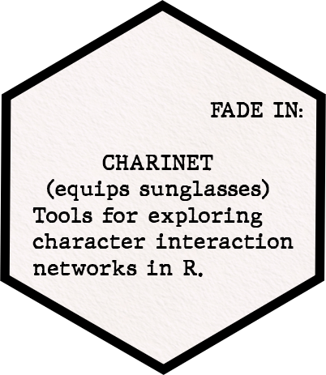

+++
draft = false
date = 2021-09-24T10:18:00Z
title = "charinet: A package for character interaction network analysis."
description = "Introduction to charinet, an R package for analysing character interaction network data"
tags = ["R", "networks", "movies"]
+++



As part of my ESRC postdoc fellowship I have been working on turning the tools I use in my research to analyse character interaction networks into an R package called [charinet](https://github.com/pj398/charinet). 

I won't go into detail here about what the package does and how it works because the GitHub README contains a pretty extensive demo. But the main things it offers are:

 - Functions for quickly reading in and reshaping lists of character interactions in common data structures.
 - A screenplay parser which will extract a relational event list from a well-formatted PDF of a screenplay.
 - An implementation of the dynamic narrative centrality measure proposed in our *Social Networks* [paper](https://doi.org/10.1016/j.socnet.2020.03.003).
 - Functions for visualising the character interaction data as heatmaps, networks and dynamic centrality trajectories.

 I've been using the package myself for the last few months and it has really improved my workflow for the common tasks that I usually want to do when analysing character interaction data.

 It also works well in conjunction with the data already available in the [movienetdata](https://github.com/pj398/movienetdata) package.

With just a few lines of code, you can get a good sense of the character dynamics of a given narrative:

```
iron_man <- movienetdata::mcu01_ironman

# Plot as a network:
plot_charinet(adjacency = iron_man$adjacency, 
              char_names = iron_man$node_list$char_name, 
              degree = iron_man$node_list$nlines, 
              node_fill = ifelse(iron_man$node_list$char_female, 
                                 "#ded649", "#55467a"), 
              parallel_edges = TRUE, 
              title = "Dialogue in Iron Man (2008)")

# Plot as a character activity heatmap:
iron_man$event_list %>%
    activity_heatmap(char_names = iron_man$node_list$char_name, 
                     story_chunk_col = 2, 
                     from = 3) %>%
    plot_heatmap(title = "Activity heatmap for Iron Man by scene")

# Plot dynamic centrality scores:
iron_man$event_list %>%
    narrative_centrality(char_names = iron_man$node_list$char_name,
                         mode = "out", 
                         wp = 0.01,
                         normalised = TRUE, 
                         from = 3) %>%
    plot_nc(title = "Speaking centrality scores for characters in Iron Man (2008)")
```

 
I'd love for people to try it out and let me know if it works for them and if there's anything else they'd like a package like this to do. I've tried to document everything clearly in the package, but do let me know if any of the functions or arguments aren't clear.
