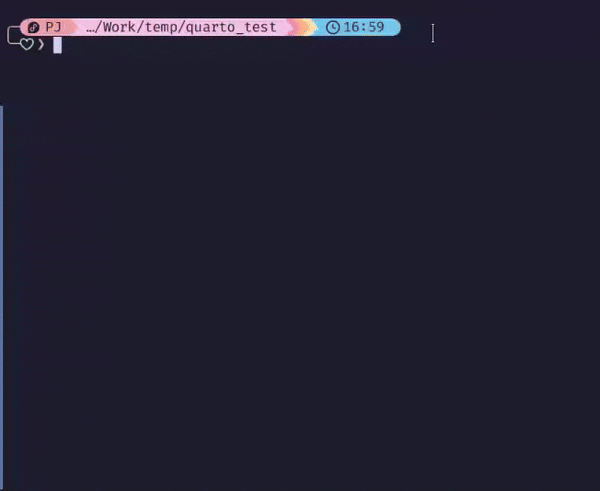

+++
draft = false
date = 2024-10-14T14:00:00Z
title = "Using project scripts to keep Quarto source and output files organised"
description = "A quick walkthrough of using post-render scripts to augment Quarto's handling of notebook files contained in project subdirectories."
[taxonomies]
tags = ["R", "quarto", "guides"]
+++

In this post I just want to share a quick tip for how to solve a very specific problem when working with [Quarto](https://quarto.org) projects: you want to keep your notebook source (.qmd) files and your notebook output (.pdf, .html etc) files separate, and you keep your source files in a subdirectory within the project. I'll talk a little bit about why that's a problem, and how to leverage one of Quarto's cool but lesser-known features to get around it.

## The problem

### Project-based workflows

If you're working with computational notebooks, you're probably also working with a project-based workflow. By this I really just mean you have a base directory for your project, you organise the files for your project in subdirectories, and you specify paths to files relative to the project base directory.

For an R user, the structure of a simple data analysis project called `my_project` might look something like this:

```
my_project/
├── data/
│   ├── raw/
│   │   └── raw_data.csv
│   └── processed/
│       └── cleaned_data.csv
├── scripts/
│   └── clean_raw_data.R
├── figs/
│   └── fig1.png
├── .Rprofile
└── README.md
```

Generally, it's a good idea to keep different types of files used in the project in their own semantic subdirectories like this, rather than keeping them in the project base directory.

The same principle applies to projects that make use of Quarto notebooks too, and Quarto actually has built-in functionality for defining projects. [Quarto projects](https://quarto.org/docs/projects/quarto-projects.html) are marked by a `_quarto.yml` file in the project base directory, with project-level options and preferences being defined in this file. 

However, if you keep your notebook source files in a subdirectory, similar to the `scripts/` example above, Quarto's default behaviour will make it a little harder to keep the notebook files organised.

### So what's the issue with Quarto projects and subdirectories?

When you `render` a Quarto notebook, the rendered output file will by default be placed alongside the notebook source file. For small projects, this may not be a problem. However, as the number of notebooks and/or output formats starts to grow, the situation can quickly become quite messy. In these situations, it's helpful to have the rendered documents live in one folder, and the notebook source files that you edit in another folder.

This is where the problem lies for Quarto projects. Quarto allows you to [specify an output directory](https://quarto.org/docs/reference/projects/options.html) in your project's metadata, in which case it will move output to that directory after rendering. However, it always considers any project subdirectories containing the notebook source file as part of the notebook's file name, so it will reproduce the subdirectory structure *inside the output directory*.

Let's illustrate what I mean by this with an example. If you want your rendered notebooks to live in the `quarto_output/` folder, you can specify `output-dir: quarto_output` in the `_quarto.yml` file. If you put your notebook `my_notebook.qmd` in the project base directory and `render` it to, say, a PDF document using Quarto, Quarto will place `my_notebook.pdf` in `quarto_output/`, which is great. 

However, if your source file is in `scripts/my_notebook.qmd`, Quarto will place the rendered notebook in `quarto_output/scripts/my_notebook.pdf`, which is less great, and probably isn't what most people meant when they specified `output-dir: quarto_output`. It is, however, [the intended behaviour](https://github.com/quarto-dev/quarto-cli/issues/1691), and the Quarto devs have not indicated any intention to make the `output-dir` option behave more like the user is likely to expect.

## How to solve the problem

Hopefully, Quarto will eventually add a feature that provides a smoother way of keeping output and source files for notebooks separate in projects using a subdirectory for the notebook source. Until then, we can make use of Quarto's project script capabilities to take care of this.

### Project scripts

As part of the rendering pipeline, Quarto allows users to specify [pre- and post-render scripts](https://quarto.org/docs/projects/scripts.html#pre-and-post-render), which can integrate additional tasks into the process. 

There are lots of possible uses for these scripts, and one particularly helpful one for our purposes is automatically organising your project files after each render. To do this, all we need to do is create a script called, say, `_move_quarto_output.R` that moves rendered notebooks from the source folder to a separate output folder. Then we just make sure that script is located in the project base directory and point `post-render` to it in the project's `_quarto.yml` metadata:

```yaml
project:
  post-render: _move_quarto_output.R
```

The script will be called each time `quarto render` is run, at the end of [pandoc](https://pandoc.org/)'s rendering of the notebook to the specified output format.

Note that pre- and post-render scripts in Quarto projects can be written in any language that Quarto can interpret, or can just be shell commands, giving you a tonne of flexibility.

### How my post-render script looks

Here is the rather clunky script I use in my Quarto projects, which makes the following assumptions based on my own typical workflow (each of these assumptions can be relaxed by modifying the script):
- notebook source files are stored in the project subdirectory `scripts_and_notebooks/`.
- we want to move the rendered notebooks to a project subdirectory `quarto_output/`, and we don't want to nest rendered notebooks in further subdirectories of `quarto_output`.
- all rendered notebooks are HTML files.

```r
# Give quarto/pandoc time to ensure the creation of .html files is finished
Sys.sleep(1.5)

# Create `quarto_output` if it doesn't exist
if (!dir.exists("quarto_output")) {
  dir.create("quarto_output")
}

# Grab the full file paths, allowing for a couple levels of directory nesting
old_html_files <- c(Sys.glob("scripts_and_notebooks/*.html"),
                    Sys.glob("scripts_and_notebooks/*/*.html"),
                    Sys.glob("scripts_and_notebooks/*/*/*.html"))

if (length(old_html_files) > 0) {
  # Convert the old file paths to where we want them to go, 
  #   collapsing nested directories into the new file name
  new_html_files <- old_html_files |>
    stringr::str_replace_all("scripts_and_notebooks/", "quarto_output/") |>
    stringr::str_replace_all("(quarto_output/.*)(/)(.*)", "\\1_\\3")

  # Move the files (stored in a var as file.rename returns a logical vector)
  renamed <- file.rename(from = old_html_files, to = new_html_files)

  # Print the outcome to the screen
  if (!FALSE %in% renamed) {
    cli::cli_alert_success("{length(renamed)} file{?s} moved successfully:")
    for (i in 1:length(renamed)) {
      cli::cli_bullets(c(
        "",
        {old_html_files[i]},
        ">" = cli::col_green({new_html_files[i]})
      ))
    }
  }
} else {
  cli::cli_alert_danger("Tried moving generated .html files but none were found.")
}

```

What the script does is grab the project-relative file paths of the rendered HTML files using `base::Sys.glob()`, and then uses `base::file.rename()` to modify these paths, effectively moving the files. Regular expressions are used (via [stringr](https://stringr.tidyverse.org/)) to incorporate any nested source subdirectories into the output file name (such that `source/subdir/notebook1.qmd` results in `output/subdir_notebook1.html`).

The output from the script will be appended at the end of `quarto render`'s CLI output, which is why I use functions from the [cli](https://cli.r-lib.org/) package to print a summary of the operation:



That's it! Let me know [@pete@fedi.petejon.es](https://fedi.petejon.es/@pete) if this helps or if there are even easier ways of dealing with this.

***

